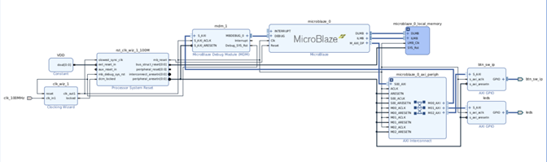

# MicroBlaze Embedded System Integration

This stage of the project demonstrates processor-based FPGA system development using the **MicroBlaze soft processor** within the Vivado design environment. Unlike the previous stage, which focused purely on hardware RTL design, this stage introduces **hardware–software co-design** by integrating AXI-based peripherals with an embedded processor and controlling FPGA hardware using software written in C.

The MicroBlaze processor is implemented inside the FPGA fabric and communicates with peripherals through an **AXI interconnect**. AXI GPIO peripherals provide access to the Zybo Z7-10 board LEDs, DIP switches, and push buttons, allowing the embedded software to interact with external hardware.

Two implementations were developed in this stage:

1. A processor-driven LED counter (`lab2a`)
2. An interactive embedded application using switches and push buttons (`lab2b`)

These implementations demonstrate how software running on a processor can control FPGA peripherals through **memory-mapped I/O**.

---

# Development Environment

## Hardware Platform

- Zybo Z7-10 Development Board  
- Xilinx Zynq-7000 SoC  
- MicroBlaze Soft Processor implemented in FPGA fabric

## Tools

- Vivado Design Suite  
- Vitis IDE  
- AXI Interconnect  
- AXI GPIO  
- Embedded C

---

# System Architecture

The system was constructed using **Vivado IP Integrator**, which allows FPGA-based processor systems to be assembled using reusable IP blocks.

The architecture includes:

- MicroBlaze Processor
- Local BRAM Memory
- AXI Interconnect
- AXI GPIO peripherals
- Clocking Wizard
- Processor System Reset

The processor communicates with peripherals through **memory-mapped registers** exposed through AXI GPIO modules.

```
MicroBlaze Processor
        │
        ▼
   AXI Interconnect
        │
   ┌────┴─────┐
   │          │
AXI GPIO   AXI GPIO
 (LEDs)    (Switches & Buttons)
```

---

# Implementation 1: Software-Driven LED Counter

The first implementation verifies correct operation of the MicroBlaze processor system by controlling the Zybo board LEDs through software.

## Hardware Configuration

The hardware system contains:

- MicroBlaze processor
- AXI GPIO configured as output
- Local BRAM memory (64 KB)
- Clock generation logic
- Reset controller

The GPIO peripheral is connected to the **four onboard LEDs**.

## Software Implementation

A C application (`lab2a.c`) was written to:

1. Initialize the LED GPIO peripheral
2. Maintain a counter variable
3. Continuously increment the counter
4. Write the lower four bits of the counter value to the LED outputs

## Functional Behavior

The LEDs repeatedly display values:

```
0 → 1 → 2 → ... → 15 → 0
```

This confirms:

- Correct processor execution
- Proper GPIO initialization
- Successful communication between the processor and hardware peripherals

Console output from Vitis was used to verify correct program execution.

---

# Implementation 2: Interactive Input-Controlled System

The system was extended to support real-time user interaction through DIP switches and push buttons.

## Hardware Extension

An additional **8-bit AXI GPIO peripheral** was added to the block design.

The GPIO input lines were mapped as follows:

| GPIO Bits | Hardware Input |
|-----------|---------------|
| [3:0] | DIP switches |
| [7:4] | Push buttons |

After modifying the hardware design:

1. The block design was validated
2. The FPGA bitstream was regenerated
3. The hardware platform was re-exported to Vitis

---

## System Block Diagram

The MicroBlaze system used for the interactive design is shown below.



---

## Interactive Software Behavior

A second application (`lab2b.c`) implements interactive functionality based on button inputs.

The software maintains a **COUNT variable** and performs the following operations:

| Push Button | Function |
|-------------|----------|
| BTN0 | Increment COUNT |
| BTN1 | Decrement COUNT |
| BTN2 | Display DIP switch values |
| BTN3 | Display COUNT value on LEDs |

The software continuously reads the GPIO input register and updates the system behavior accordingly.

---

# Debugging and Verification

The **Vitis console** was used to monitor runtime output and verify system behavior.

During development, an issue occurred due to an incorrect mask value when decoding push button inputs. By observing hexadecimal values printed in the console, the issue was identified and corrected.

Additionally, after modifying the hardware design, the bitstream had to be regenerated and the hardware platform re-exported so that updated hardware definitions would appear in the automatically generated `xparameters.h` file.

---

# Repository Structure

Important files and directories in this stage include:

### Hardware Projects

```
lab_2.xpr
lab_2.srcs/
lab_2.runs/
lab_2.hw/

lab_2b_new.xpr
lab_2b_new.srcs/
lab_2b_new.runs/
```

These directories contain the **Vivado hardware projects** used to build the MicroBlaze system.

---

### Hardware Platform Files

```
btn_sw_led_wrapper.xsa
led_sw_wrapper.xsa
```

These files represent the **hardware platform exported from Vivado** and used by Vitis to build the software applications.

---

### Software Applications

```
lab2a.c
lab2b.c
```

- `lab2a.c` – LED counter implementation  
- `lab2b.c` – Interactive input-controlled application

---

### Documentation and Results

```
block_diagram_lab2b.png
lab2b_Results.png
README.md
```

---

# Outcome

The MicroBlaze-based embedded system successfully demonstrated processor-driven control of FPGA peripherals. The processor was able to control LEDs, read user inputs from switches and push buttons, and respond dynamically to user interaction.

This stage establishes the foundation for more advanced embedded FPGA systems where processors interact with custom hardware accelerators and device drivers through AXI-based interfaces.