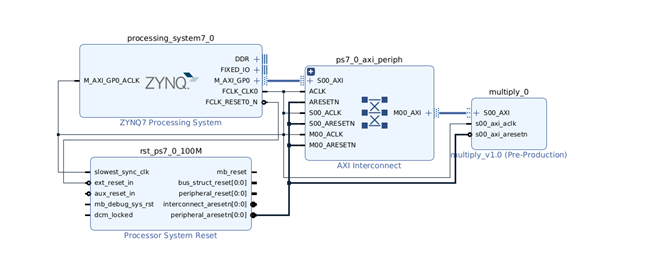
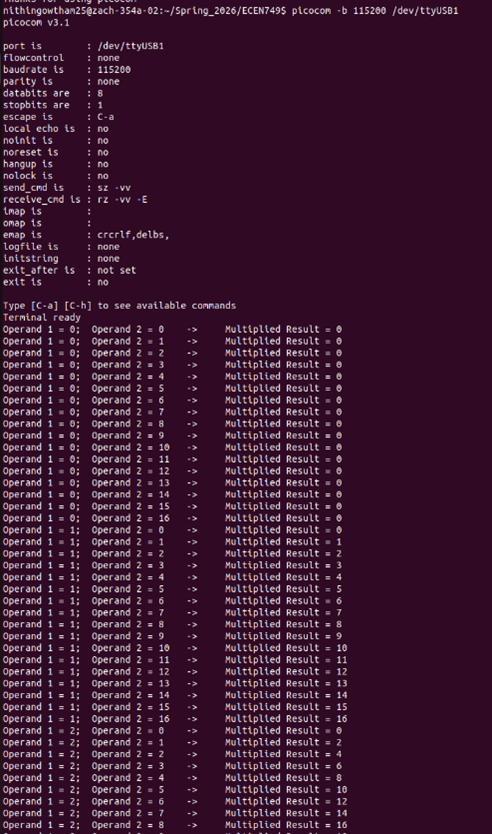

# Custom AXI Hardware Peripheral Integration

This stage of the project demonstrates the creation and integration of a **custom hardware accelerator** in the programmable logic of the **Zynq-7000 SoC** on the **Zybo Z7-10 development board**.

Unlike previous stages that used predefined IP blocks, this stage involves designing a **custom AXI4-Lite peripheral** and integrating it with the **ARM Cortex-A9 processor** inside the Zynq Processing System (PS). The custom hardware module performs integer multiplication, while the processor communicates with the hardware through memory-mapped registers using the AXI interconnect.

This implementation demonstrates a fundamental concept in embedded FPGA systems: **hardware–software co-design**, where computational tasks can be accelerated in programmable logic while control remains in software.

---

## Development Environment

## Hardware Platform

- Zybo Z7-10 Development Board  
- Xilinx Zynq-7000 SoC  
- ARM Cortex-A9 Processing System  
- Programmable Logic (FPGA fabric)

## Tools

- Vivado Design Suite  
- Vitis IDE  
- AXI4-Lite Interface  
- Embedded C  
- UART Serial Console

---

## System Architecture

The system integrates the **Zynq Processing System** with a **custom AXI peripheral** implemented in programmable logic.

The processor writes input operands to hardware registers through AXI, and the custom hardware performs the multiplication and stores the result in a result register that the processor can read.


ARM Cortex-A9 Processor (PS)
            │
            ▼
      AXI Interconnect
            │
            ▼
     Custom Multiply IP
   ┌────────┬─────────┐
   │        │         │
 slv_reg0  slv_reg1  slv_reg2
 Operand A Operand B  Result


---

## Custom Hardware Peripheral

A custom **AXI4-Lite peripheral** named `multiply` was created and packaged as reusable IP.

## Peripheral Configuration

The IP was generated with the following properties:

- AXI4-Lite interface  
- Slave mode  
- 32-bit data width  
- Four memory-mapped registers  

| Register | Purpose |
|--------|--------|
| `slv_reg0` | Operand A |
| `slv_reg1` | Operand B |
| `slv_reg2` | Multiplication result |
| `slv_reg3` | Reserved |

---

## Hardware Logic

The multiplication operation is implemented inside the **AXI clock domain**.

The processor writes operands to the input registers, and the programmable logic computes the result.

Example implementation:

```verilog
always @(posedge S_AXI_ACLK) begin
    if (!S_AXI_ARESETN)
        slv_reg2 <= 32'd0;
    else
        slv_reg2 <= slv_reg0 * slv_reg1;
end
```
To prevent software from overwriting the result register, the write logic for slv_reg2 was disabled in the AXI register write block.

---

## Integration with Zynq Processing System

The custom IP was integrated into the processing system using Vivado IP Integrator.

The design includes:
- Zynq Processing System
- AXI Interconnect
- Custom Multiply IP
- UART interface for serial communication

After integration:
- The design was validated
- An HDL wrapper was generated
- The FPGA bitstream was created
- The hardware platform was exported to Vitis as an .xsa file

---

## Software Application

A software application was developed in Vitis to test the custom hardware peripheral.

The program performs the following steps:
- Write a value to slv_reg0
- Write a value to slv_reg1
- Read the multiplication result from slv_reg2
- Print the operands and result using printf

## Example operation:

Operand A = 5
Operand B = 7
Result = 35

Communication between the processor and the multiplier IP occurs through memory-mapped AXI registers.

---

## Serial Console Output

The application output was observed through a UART serial console using picocom.

Example console output:

Multiplication Test
5 x 7 = 35
3 x 9 = 27
10 x 12 = 120

This confirms correct communication between the processor and the custom hardware accelerator.


---

## Key Concepts Demonstrated

This stage introduces several important FPGA and embedded system concepts:

- Custom AXI peripheral creation  
- Hardware IP packaging in Vivado  
- AXI4-Lite register interfaces  
- Hardware–software co-design  
- Communication between processing system and programmable logic  
- Memory-mapped I/O  
- Embedded software interaction with hardware accelerators  

---

## Design Considerations

### Arithmetic Overflow

Since the registers are 32-bit, multiplying two large values can produce a **64-bit result**, which may lead to overflow.

Example correction:

```verilog
reg [63:0] product;

always @(posedge S_AXI_ACLK) begin
    if (!S_AXI_ARESETN)
        product <= 64'd0;
    else
        product <= slv_reg0 * slv_reg1;
end
```
The 64-bit result can be split across multiple registers to preserve all bits.

---

### Multi-Cycle Operations

If the multiplication were implemented as a multi-cycle or pipelined operation, the processor could read the result before computation completes.

In such cases, a valid or ready signal should be implemented to synchronize the processor read operation with the hardware computation.

---

## Outcome
The custom multiplier peripheral was successfully integrated with the Zynq processing system and verified through software execution on the ARM Cortex-A9 processor. The processor was able to write operands to the hardware registers, trigger computation in programmable logic, and read the resulting product through AXI communication.

This stage demonstrates the ability to design custom hardware accelerators and integrate them with embedded software, which is a fundamental technique for improving performance in modern embedded FPGA systems.