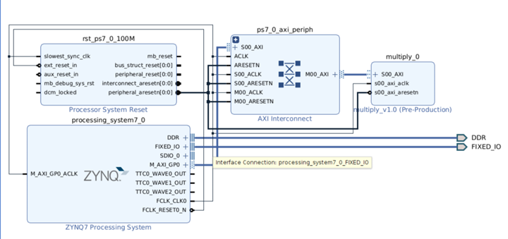

# Linux Kernel Module Development and Hardware Interaction

This stage of the project focuses on extending the embedded Linux platform to support **kernel-space execution and hardware interaction** through dynamically loadable Linux kernel modules on the **Zynq-7000 SoC**.

Unlike the previous stage, which established a Linux-capable hardware platform, this stage enables **direct interaction between the Linux kernel and custom FPGA hardware**. By developing kernel modules, the system transitions from user-space applications to **low-level system software capable of accessing memory-mapped hardware resources**.

This stage is a critical step toward **Linux device driver development** in embedded FPGA-based systems.

---

## Development Environment

### Hardware Platform

* Zybo Z7-10 Development Board
* Xilinx Zynq-7000 SoC
* ARM Cortex-A9 Processing System
* Custom AXI Multiply Peripheral

### Tools

* PetaLinux
* Vivado (hardware platform from previous stage)
* Linux Kernel (Zynq)
* UART Serial Console (`picocom`)

---

## System Architecture

The system consists of **Embedded Linux running on the ARM processor**, with kernel modules dynamically loaded into the Linux kernel to enable direct interaction with programmable logic.

The processor communicates with the custom AXI multiplier IP through **memory-mapped AXI interfaces**, allowing kernel-space software to read and write hardware registers.

### Block Diagram



This architecture enables kernel modules to act as a bridge between the Linux kernel and FPGA-based hardware accelerators.

---

## Kernel Module Development

Two kernel modules were developed as part of this stage:

### Hello Module

A basic kernel module used to understand:

* Kernel module initialization and cleanup
* Use of `printk()` for kernel logging
* Dynamic loading and unloading of modules

The module verifies correct kernel integration by printing messages during insertion and removal.

---

### Multiply Module

A kernel module designed to interface with the **custom AXI multiplier hardware**.

The module performs:

* Memory mapping of hardware registers using `ioremap()`
* Writing operands to hardware registers using `iowrite32()`
* Reading computed results using `ioread32()`
* Logging results using `printk()`

This demonstrates **kernel-level communication with hardware peripherals**.

---

## Hardware Interaction

Since Linux operates in a **virtual memory space**, kernel modules must map physical hardware addresses before accessing them.

### Address Mapping Mechanism

* `ioremap()` → maps physical hardware address to virtual address
* `iounmap()` → releases mapped memory

This enables safe and controlled access to FPGA hardware registers from kernel space.

---

## Kernel Integration using PetaLinux

The kernel modules were integrated into the embedded Linux system using **PetaLinux**.

### Project Location

* `petalinux_project/`

### Kernel Module Recipes

* `petalinux_project/project-spec/meta-user/recipes-modules/hello/`
* `petalinux_project/project-spec/meta-user/recipes-modules/multiply/`

Each module includes:

* Source files (`.c`)
* Makefiles
* BitBake recipes (`.bb`)

### BSP Customization

* `petalinux_project/project-spec/meta-user/recipes-bsp/`

Includes:

* Device tree modifications
* Bootloader configuration

---

## Linux Boot Artifacts

The generated Linux images and boot components are located at:

* `petalinux_project/images/linux/`

Key files include:

* `image.ub` → Linux kernel + device tree + initramfs
* `system.dtb` → Device tree blob
* `u-boot.bin` → Bootloader
* `zynq_fsbl.elf` → First-stage bootloader

These files are used to boot the embedded Linux system on the Zybo board.

---

## Repository Structure

The following structure is used in this stage:

```
.
├── hello/
│   ├── hello.c
│   ├── Makefile
│   ├── hello.bb
│   └── hello.ko
│
├── multiply/
│   ├── multiply.c
│   ├── Makefile
│   ├── multiply.bb
│   ├── multiply.ko
│   ├── xparameters.h
│   └── xparameters_ps.h
│
├── petalinux_project/
│   ├── project-spec/
│   │   └── meta-user/
│   │       ├── recipes-modules/
│   │       │   ├── hello/
│   │       │   └── multiply/
│   │       └── recipes-bsp/
│   │
│   └── images/linux/
│       ├── image.ub
│       ├── system.dtb
│       ├── u-boot.bin
│       ├── zynq_fsbl.elf
│       └── ...
│
├── docs/
│   ├── replication_guide.md
│   └── results/
│
└── structure.txt
```

---

## Key Concepts Demonstrated

This stage demonstrates several critical concepts in embedded Linux system design:

* Linux kernel module development
* Kernel vs user space execution
* Dynamic module loading and unloading
* Kernel logging using `printk()`
* Memory-mapped I/O in Linux
* Physical-to-virtual address mapping (`ioremap`)
* Kernel-level interaction with FPGA hardware

---

## Outcome

Linux kernel modules were successfully developed and deployed on the embedded system. The modules demonstrated reliable communication between the Linux kernel and custom FPGA hardware through memory-mapped I/O.

This stage establishes the foundation for:

* Linux device driver development
* Character device drivers
* Advanced kernel-level hardware interaction

and represents a key milestone in building a complete **ARM-based SoC software stack integrating FPGA hardware and Embedded Linux**.
