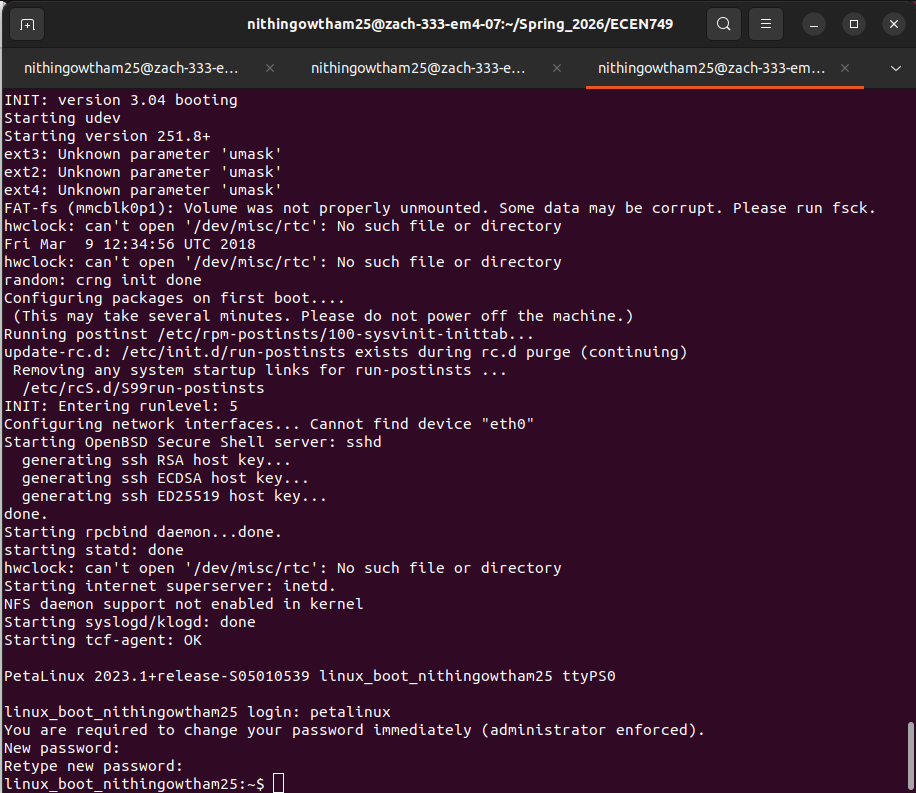
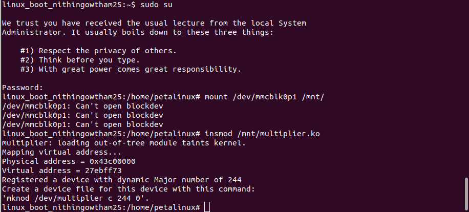
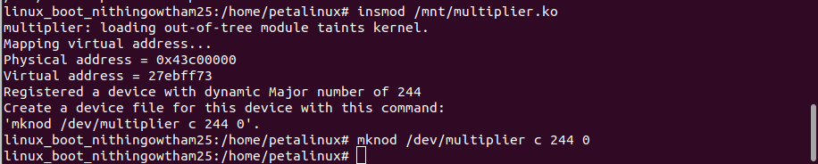
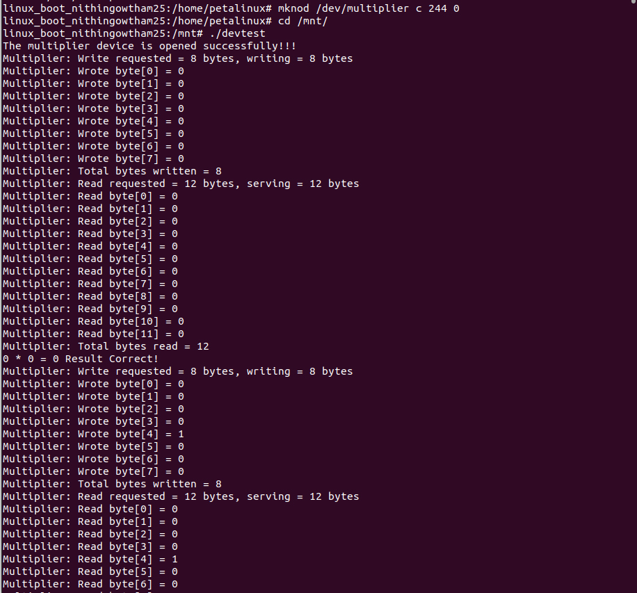
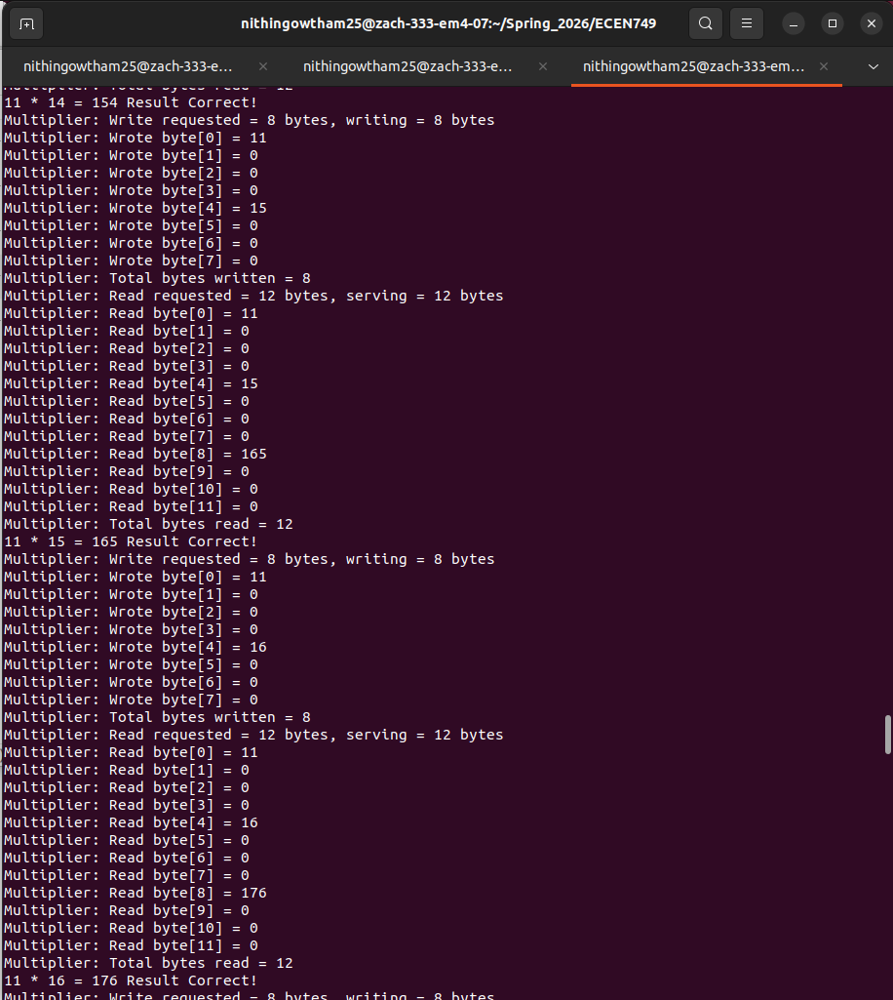
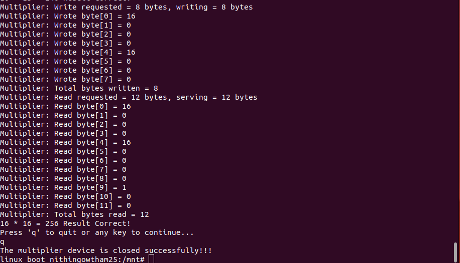
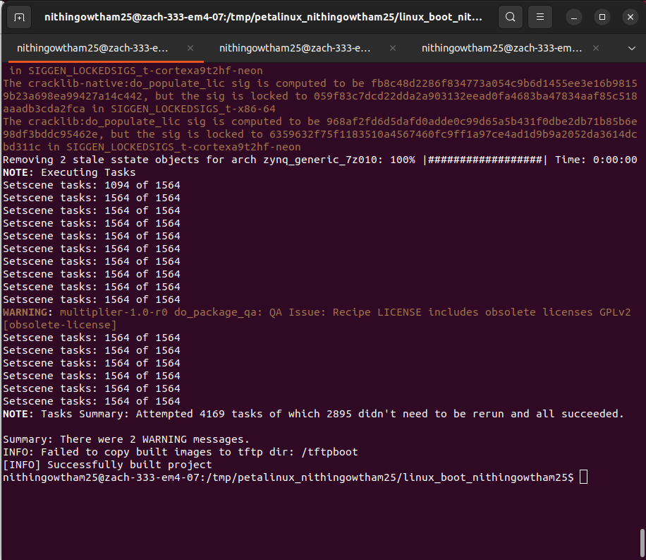

# Character Device Driver Development and User–Kernel Interaction

This stage of the project focuses on developing a **Linux character device driver** to enable communication between user-space applications and custom FPGA hardware on the **Zynq-7000 SoC**.

Building upon the kernel module developed in the previous stage, this implementation introduces a **file-based abstraction (`/dev/multiplier`)**, allowing user applications to interact with hardware using standard system calls. The device driver acts as a bridge between user space and kernel space, enabling controlled and safe access to memory-mapped hardware.

This stage represents a critical step toward **Linux device driver development** in embedded systems.

---

## Development Environment

### Hardware Platform

* Zybo Z7-10 Development Board
* Xilinx Zynq-7000 SoC
* ARM Cortex-A9 Processing System
* Custom AXI Multiply Peripheral

### Tools

* PetaLinux
* Vivado (hardware platform from previous stages)
* Linux Kernel (Zynq)
* UART Serial Console (`picocom`)

---

## System Architecture

The system integrates **user-space applications**, **kernel-space device drivers**, and **hardware peripherals**.

User applications interact with the device driver through:

```bash
/dev/multiplier
```

### Architecture Flow

```text
User Application
       │
       ▼
 /dev/multiplier
       │
       ▼
 Character Device Driver (Kernel Space)
       │
       ▼
 AXI Multiply Peripheral (Hardware)
```

This clearly separates:

* User space (application layer)
* Kernel space (driver layer)
* Hardware (FPGA peripheral)

---

## Character Device Driver Implementation

The character device driver is implemented in:

```text
multiplier/
```

### Key Files

* `multiplier.c` → Driver implementation
* `multiplier.h` → Driver definitions
* `multiplier.bb` → BitBake recipe
* `Makefile` → Build configuration
* `xparameters.h`, `xparameters_ps.h` → Hardware address mapping

---

### Core Features

* Dynamic device registration (major number assigned by kernel)
* Memory mapping using `ioremap()`
* Safe unmapping using `iounmap()`
* Hardware interaction via memory-mapped I/O

---

### File Operations Implemented

| Function    | Description                          |
| ----------- | ------------------------------------ |
| `open()`    | Logs device access                   |
| `close()`   | Logs device closure                  |
| `read()`    | Transfers data from hardware to user |
| `write()`   | Transfers data from user to hardware |

---

## User–Kernel Data Transfer

Safe data transfer between user space and kernel space is implemented using:

* `get_user()` → copy data from user space
* `put_user()` → copy data to user space

### Address Constraints

* Read operations: bytes **0–11**
* Write operations: bytes **0–7**

---

## User Application (Testbench)

The user-space application is located in:

```text
testbench/
```

### Files

* `devtest.c` → User-space test application
* `devtest.exe` → Compiled executable

---

### Functionality

* Opens `/dev/multiplier`
* Writes operands to hardware
* Reads multiplication results
* Verifies correctness against software computation

The application iterates through multiple test cases (0–16) to validate correctness.

---

## PetaLinux Integration

The driver is integrated into the Linux system using:

```text
petalinux_project/project-spec/meta-user/
```

### Module Recipe Location

```text
recipes-modules/multiplier/
```

The BitBake recipe (`multiplier.bb`) ensures the driver is included in the Linux build.

---

## Deployment and Execution

### 1. Build System

```bash
petalinux-build
```

---

### 2. Boot System

System booted using SD card with:

* `BOOT.BIN`
* `image.ub`
* `boot.scr`

---

### 3. Insert Driver

```bash
insmod /mnt/multiplier.ko
```

---

### 4. Create Device Node

```bash
mknod /dev/multiplier c <major_number> 0
```

---

### 5. Run Test Application

```bash
cd /mnt/
./devtest
```

---

## Replication Guide

A comprehensive guide documenting the complete workflow—from driver implementation to deployment and validation—is available below:

📄 [Replication Guide (PDF)](docs/replication_guide.pdf)

This includes:
- Character device driver development steps  
- PetaLinux integration and build process  
- Device node creation and testing  
- Execution results and validation screenshots  

---

## Results

### System Boot



---

### Module Insertion



---

### Device Node Creation



---

### Device Open Operation



---

### Multiplication Results



---

### Device Close Operation



---

### Build Success



---

### Observations

* Kernel module loaded successfully
* Device registered with dynamic major number
* `/dev/multiplier` created correctly
* User application executed without errors
* Data transfer between user space and kernel space verified
* Hardware multiplication results matched expected values

---

## Reference Code

Reference implementations used for development are located in:

```text
reference_code/
```

These include example character device implementations used as a baseline for driver development.

---

## Repository Structure

```text
.
├── docs/
│   ├── replication_guide.pdf
│   └── results/
│
├── multiplier/
│   ├── Makefile
│   ├── multiplier.bb
│   ├── multiplier.c
│   ├── multiplier.h
│   ├── xparameters.h
│   └── xparameters_ps.h
│
├── reference_code/
│   ├── my_chardev.c
│   ├── my_chardev.h
│   ├── my_chardev_mem.c
│   └── my_chardev_mem.h
│
├── testbench/
│   ├── devtest.c
│   └── devtest.exe
│
├── build.log
└── README.md
```

---

## Key Concepts Demonstrated

* Character device driver development
* User space ↔ kernel space interaction
* File-based device abstraction (`/dev`)
* Linux system calls (`open`, `read`, `write`, `close`)
* Memory-mapped I/O in Linux
* Safe data transfer (`get_user`, `put_user`)
* Kernel module lifecycle management
* Hardware abstraction using device drivers

---

## Outcome

A fully functional **character device driver** was developed and deployed on an embedded Linux system. The driver successfully enables user-space applications to interact with FPGA-based hardware using standard Linux interfaces.

This stage completes the transition from:

```text
Hardware → Kernel Module → Device Driver → User Application
```

and establishes a strong foundation for:

* Advanced Linux device drivers
* IOCTL-based control interfaces
* Scalable hardware abstraction layers

This represents a key milestone in building a complete **ARM-based SoC software and driver development stack**.
