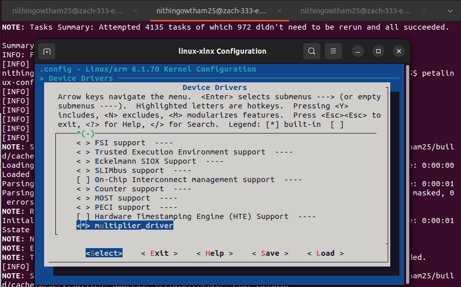
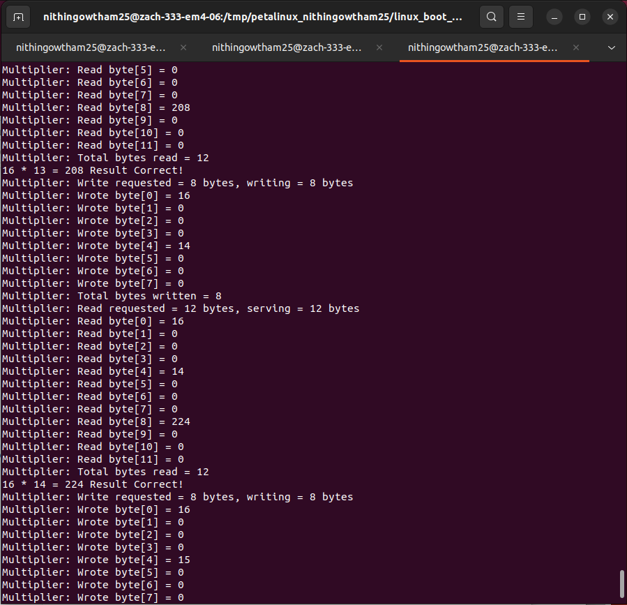

# Linux Kernel Customization and Built-in Driver Integration

This stage of the project focuses on integrating a **custom Linux character device driver directly into the Linux kernel** as a **built-in driver** on the **Zynq-7000 SoC**.

Unlike the previous stage, where the multiplier driver was deployed as a **Loadable Kernel Module (LKM)**, this implementation embeds the driver into the Linux kernel source tree, allowing it to be initialized automatically during system boot without requiring manual insertion using `insmod`.

In addition to driver integration, the Linux kernel was customized by extending the kernel build system, configuring new Kconfig entries, and removing unnecessary subsystems to generate a smaller and more efficient kernel image for the target embedded platform.

This stage demonstrates advanced concepts in **Linux kernel customization**, **built-in device driver integration**, and **embedded Linux optimization**.

---

# Development Environment

## Hardware Platform

- Zybo Z7-10 Development Board
- Xilinx Zynq-7000 SoC
- ARM Cortex-A9 Processing System
- Custom AXI4-Lite Multiplier Peripheral

## Tools

- PetaLinux 2023.1
- Vivado Design Suite
- Embedded Linux
- Linux Kernel Source
- Menuconfig
- UART Serial Console (`picocom`)

---

# System Architecture

The embedded Linux system integrates the ARM processing system with a custom FPGA hardware accelerator through a **built-in Linux character device driver**.

Unlike dynamically loaded kernel modules, the driver is compiled directly into the Linux kernel and becomes available immediately after the kernel boots.

```text
User Application (devtest)
            │
            ▼
     Built-in Character Driver
            │
            ▼
 Memory-Mapped AXI Registers
            │
            ▼
 Custom Multiplier Peripheral
```

This architecture eliminates runtime module insertion while maintaining seamless communication between user-space applications and FPGA hardware.

---

# Built-in Driver Integration

The multiplier driver developed in the previous stage was converted from a **Loadable Kernel Module (LKM)** into a **built-in Linux kernel driver**.

## Driver Source

Located in:

```text
multiplier_driver/
```

### Contents

- `multiplier.c` — Character device driver implementation
- `multiplier.h` — Driver definitions
- `Makefile` — Kernel build rules
- `Kconfig` — Kernel configuration entry
- `xparameters.h`
- `xparameters_ps.h`

The driver is compiled directly into the Linux kernel image and is initialized automatically during system boot.

---

# Linux Kernel Source Integration

To integrate the driver into the Linux kernel build system, modifications were made to the root driver configuration.

## Root Driver Configuration

Located in:

```text
drivers_root_directory/
```

### Contents

- `Makefile`
- `Kconfig`

These files register the **multiplier_driver** directory with the Linux kernel build system, allowing the driver to appear under **Device Drivers** in `menuconfig` and participate in the kernel build process.

---

# Kernel Configuration

The custom multiplier driver was integrated into the Linux kernel configuration using **Kconfig** and enabled through **menuconfig** as a **built-in component (Y)**.

This ensures that the driver is compiled into the kernel image and initialized automatically during system boot.

### Built-in Driver Configuration



---

# Kernel Build and Optimization

After integrating the driver into the Linux kernel source:

1. The Linux kernel was rebuilt using **PetaLinux**.
2. A new bootable kernel image was generated.
3. The customized kernel image was copied to the SD card.
4. The embedded Linux system was successfully booted on the Zybo Z7-10 platform.

The kernel build process was customized using:

- `linux-xlnx_2023.1.bb`

To reduce the kernel footprint, several unused subsystems were removed, including:

- Network Device Support
- Multimedia Support
- Sound Support

This reduced the kernel image size while preserving all required functionality for the embedded application.

---

# Replication Guide

A detailed implementation guide documenting the complete workflow is available below.

📄 **[Replication Guide](docs/replication_guide.pdf)**

The guide includes:

- Linux kernel source modifications
- Built-in driver integration
- Kconfig configuration
- Kernel build process
- Deployment and boot process
- Kernel optimization
- Validation procedure

---

# Results

The customized Linux kernel was successfully rebuilt with the multiplier driver integrated as a **built-in character device driver**. Unlike the previous implementation, the driver initializes automatically during system boot without requiring manual insertion using `insmod`.

The user-space validation application successfully communicated with the hardware through the built-in driver, verifying correct memory-mapped register access and multiplication functionality.

### Driver Validation



### Observations

- Successfully converted the multiplier driver from a **Loadable Kernel Module (LKM)** into a **built-in Linux kernel driver**
- Integrated the driver into the Linux kernel source using **Kconfig** and **Makefile**
- Verified automatic driver initialization during system boot
- Successfully executed the user-space validation application without requiring runtime module insertion
- Reduced the Linux kernel footprint by disabling unnecessary subsystems while preserving complete functionality

---

# Repository Structure

```text
.
├── docs/
│   ├── replication_guide.pdf
│   └── results/
│       ├── multiplier_driver_in_kernel_config.png
│       ├── devtest_results.png
│       └── ...
│
├── drivers_root_directory/
│   ├── Kconfig
│   └── Makefile
│
├── multiplier_driver/
│   ├── multiplier.c
│   ├── multiplier.h
│   ├── Makefile
│   ├── Kconfig
│   ├── xparameters.h
│   └── xparameters_ps.h
│
├── devtest
├── linux-xlnx_2023.1.bb
├── new_image.ub
└── README.md
```

---

# Key Concepts Demonstrated

This stage demonstrates several advanced Linux kernel development concepts:

- Linux kernel customization
- Built-in device driver integration
- Character device driver architecture
- Kernel configuration using Kconfig
- Linux kernel build system
- PetaLinux kernel development
- Embedded Linux optimization
- Memory-mapped hardware interaction
- User-space to kernel-space communication

---

# Outcome

The custom multiplier driver was successfully integrated as a **built-in Linux kernel driver**, eliminating the need for runtime module insertion while ensuring immediate hardware availability after system boot.

By extending the Linux kernel source, configuring build dependencies, and optimizing the kernel configuration, this stage demonstrates the complete workflow of customizing an embedded Linux system for application-specific hardware.

This represents the final stage of the project, completing the progression from **FPGA hardware design** to **embedded Linux kernel development** on the Zynq platform and establishing a complete ARM-based SoC software stack capable of supporting custom hardware accelerators through native Linux kernel integration.